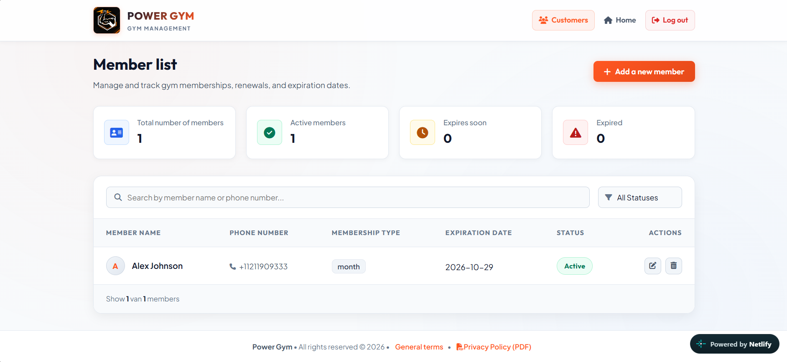

# Power Gym 🏋️‍♂️

A modern fitness center web application built with vanilla JavaScript and Supabase, featuring an interactive member management system and a secure admin dashboard.

## ✨ Features
- Member management (CRUD) with pass tracking
- Admin authentication with Supabase Auth & Row Level Security
- Public pass-expiry lookup by phone number
- Responsive design with mobile off-canvas navigation
- Auto-calculated membership expiry dates

## 📖 Context
This project was inspired by a real, observed problem at a local gym in the Netherlands: the owner tracked memberships manually on paper, making it easy to lose track of expiry dates. I designed and built this system as a self-initiated solution, then presented it to the owner for feedback.

## 🚀 Live Demo
Check out the live application: [PowerGym on Netlify](https://power-workout.netlify.app/)

## 🔑 Test Credentials (Admin Panel)
You can log in to the admin dashboard using the test account:
- **Email:** `test@mail.com`
- **Password:** `TestPassword123!`
> **Info:** This is a demo environment with test data. Feel free to explore the admin panel, data may be reset periodically.

## 🛠️ Built With
- **Frontend:** HTML5, CSS3, JavaScript (Vanilla)
- **Backend & Auth:** Supabase (Authentication & Database with Row Level Security)
- **Hosting:** Netlify

## ⚙️ Setup & Installation (Local Development)
1. Clone the repository:
   ```bash
   git clone https://github.com/GrigoriSaki/PowerGym.git
   ```

2. Create a config.js file in the js folder based on config.example.js, and fill in your own Supabase   project URL and anon key.

3. Open index.html using a local server (like Live Server in VS Code).

## 📸 Screenshots

### Home Page


### Admin Dashboard


### Checking Expiry Pass
